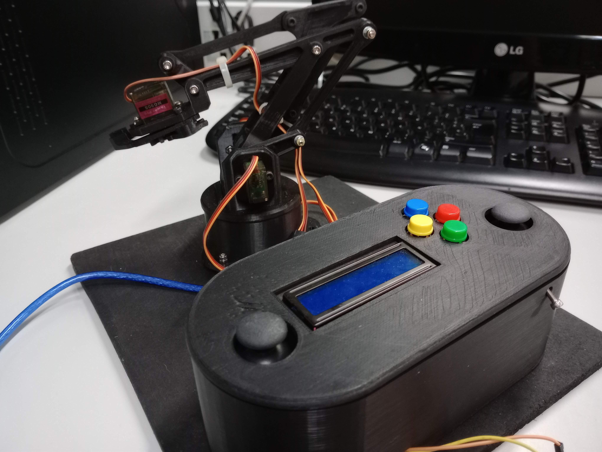

# 🤖 Electronics with Arduino

<figure style="display: flex; justify-content: center;">
  
</figure>

## 📄 Overview

This repository contains code examples developed in Arduino and Processing, along with the necessary documentation for the Creative Electronics course practices at the University of Málaga (UMA). The repository has been created primarily for tracking and version control of the course project.

## 📁 Project Structure

- exercises/
  - piezoelectrico/
  - velampara/
- robotic_arm/
  - Code/
  - Diagrams/
  - Elevator Pitch/
  - Tests/
  - README_EN.md
  - README.md
  - LICENSE
  - README_SP.md

## 🦾 Robotic Arm

The main project is a robotic arm. Details can be found at:
- Main idea: [Automated Robotic Arm That Learns](https://www.instructables.com/Automated-Robotic-Arm-That-Learns-Ft-Tinkercad-Ard/)
- Elaboration steps: [Robotic Arm Ft. Arduino Mega](https://www.instructables.com/Robotic-Arm-Ft-Arduino-Mega-TheGHIZmo-Aarav-G/)

## 📚 Contents

- Example codes for Arduino and Processing
- Practice documentation
- Robotic arm project
  - Source code
  - Diagrams
  - Presentation (Elevator Pitch)
  - Tests

## 👥 Contributors

- Exercises:
  - [Cayetano Biehler Pollaci](https://www.linkedin.com/in/cayetanobiehler/)
  - [Daniel Bazo Correa](https://www.linkedin.com/in/danibcorr/)
- Robotic arm project:
  - [Clara Rubio Almagro](https://www.linkedin.com/in/clara-rubio-almagro-688550165/)
  - [Laura Sánchez Sánchez](https://www.linkedin.com/in/laura-s%C3%A1nchez-s%C3%A1nchez/)
  - [Daniel Bazo Correa](https://www.linkedin.com/in/danibcorr/)

All contributors are students of the Degree in Electronic Systems Engineering at the University of Málaga.

## ⭐️ License
[Attribution-NonCommercial-ShareAlike 4.0 International (CC BY-NC-SA 4.0)](https://creativecommons.org/licenses/by-nc-sa/4.0/)